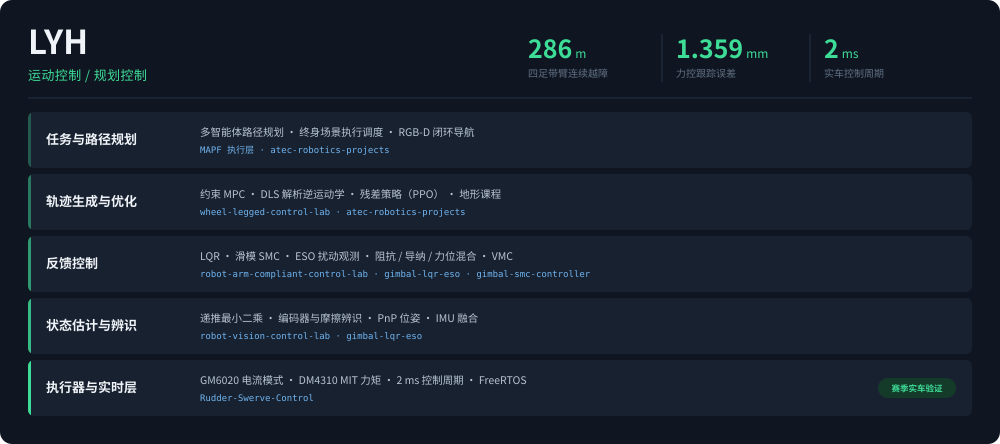
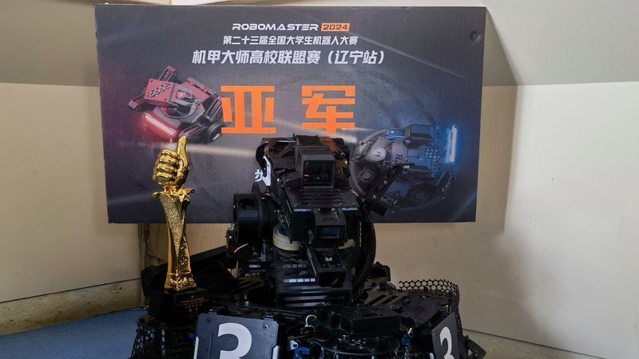
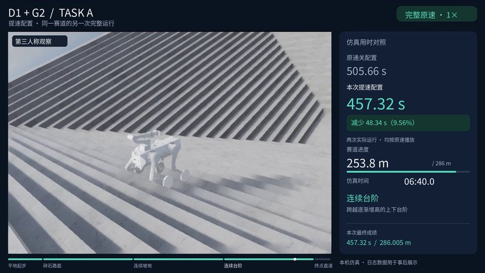
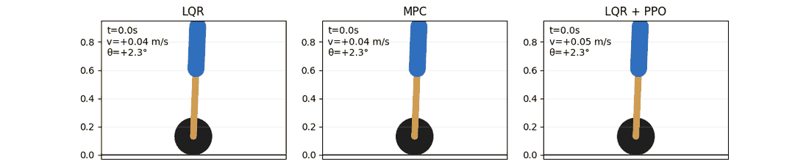

<table>
<tr>
<td width="50%"></td>
<td width="50%"></td>
</tr>
<tr>
<td valign="top">
<b><a href="https://github.com/LYHrmer/Rudder-Swerve-Control">Rudder-Swerve-Control</a></b> 
四舵轮运动学解算、就近最优角与 cos³ 轮速补偿,单精度三角函数压进 <b>2 ms 控制周期</b>。跟随云台 / 小陀螺 / 失能状态机,含超级电容功率接口。2023–2026 赛季实车代码,STM32F407 + FreeRTOS。
</td>
<td valign="top">
<b><a href="https://github.com/LYHrmer/atec-robotics-projects">atec-robotics-projects</a></b> 
ATEC 2026 仿真。四足带臂 RGB-D 闭环导航<b>连续越障 286 m</b>,同赛道调参后提速 9.6%;手写点云聚类抓取几何链配 DLS 解析逆运动学,<b>抓取 18/18</b> 三 seed 复现。
</td>
</tr>
</table>

### 控制器同场对比

同一扰动、同一机体,LQR / 约束 MPC / LQR+残差 PPO 三种控制器并排跑:

<b><a href="https://github.com/LYHrmer/wheel-legged-control-lab">wheel-legged-control-lab</a></b> —— D1 轮足整机(23 nq / 16 执行器),VMC、LQR、约束 MPC 与残差 PPO 共用同一控制循环,轮心 Jacobian 做支撑力分配。留出道路速度误差 **0.0402 → 0.0333 m/s**,达标 6/6。

### 其他控制与感知项目

**[robot-arm-compliant-control-lab](https://github.com/LYHrmer/robot-arm-compliant-control-lab)** —— Franka 7-DOF 阻抗、导纳与力位混合控制,500 Hz 接触状态机。在线切向补偿把跟踪误差从 **1.885 压到 1.359 mm**(24/24 全部改善);Python 与 C++ 两套实现对齐 16.8 万周期,最大偏差 3.6e-15。

**[gimbal-lqr-eso](https://github.com/LYHrmer/gimbal-lqr-eso)** —— 动力学前馈 + 离散 LQR + ESO 扰动观测的云台控制器,含抗饱和积分与在线参数辨识。C11、静态状态、不依赖 HAL 与 RTOS;DM4310 Pitch 跟踪误差 **降低 72.5%**。

**[gimbal-smc-controller](https://github.com/LYHrmer/gimbal-smc-controller)** —— 线性滑模加可选正则化终端项,纯 C99 无堆分配。576 组模型组合闭环仿真、12 万次递推最小二乘数值回归。

**[robot-vision-control-lab](https://github.com/LYHrmer/robot-vision-control-lab)** —— 从一帧图像到有界速度命令。四路 PnP 方案对比 + body-frame SE(3) 比例控制;PnP **6.03 mm / 1.06°**(σ=1 px、10% 外点),位姿伺服 **4.44 s 收敛**。

### 技术栈

最优控制与鲁棒控制、力控与柔顺控制、系统辨识、多智能体路径规划、强化学习 · C99/C11、Python、C++ · MuJoCo、Isaac Lab、PyTorch、ONNX · STM32F4、FreeRTOS、CMSIS-DSP、CAN · OpenCV、相机标定、PnP · ROS/ROS2、CMake、pytest
