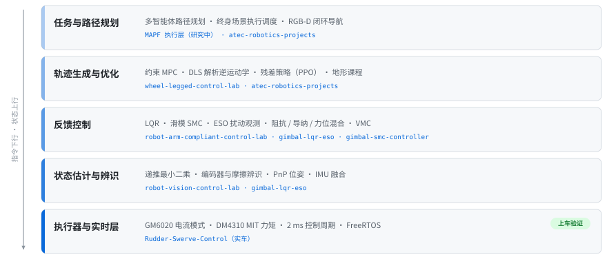

## LYH

机器人控制与运动规划方向研究生,秋招方向为**运动控制 / 规划控制**。做 RoboMaster 电控出身,现在主要做控制算法设计与多智能体路径规划。

<picture>
  <source media="(prefers-color-scheme: dark)" srcset="./assets/control-stack-dark.svg">
  
</picture>

### 控制算法

<table>
<tr>
<td width="50%" valign="top">

<b><a href="https://github.com/LYHrmer/robot-arm-compliant-control-lab">robot-arm-compliant-control-lab</a></b> 
Franka 7-DOF 阻抗、导纳与力位混合控制,500 Hz 接触状态机。在线切向补偿把跟踪误差从 <b>1.885 压到 1.359 mm</b>;Python 与 C++ 两套实现对齐 16.8 万周期,最大偏差 3.6e-15。

</td>
<td width="50%" valign="top">

<b><a href="https://github.com/LYHrmer/wheel-legged-control-lab">wheel-legged-control-lab</a></b> 
D1 轮足整机(23 nq / 16 执行器)。VMC、LQR、约束 MPC 与残差 PPO 共用同一控制循环,轮心 Jacobian 做支撑力分配;留出道路速度误差 <b>0.0402 → 0.0333 m/s</b>,达标 6/6。

</td>
</tr>
<tr>
<td width="50%" valign="top">

<b><a href="https://github.com/LYHrmer/gimbal-lqr-eso">gimbal-lqr-eso</a></b> 
动力学前馈 + 离散 LQR + ESO 扰动观测的云台控制器,含抗饱和积分与在线参数辨识。C11、静态状态、不依赖 HAL 与 RTOS;DM4310 Pitch 跟踪误差 <b>降低 72.5%</b>。

</td>
<td width="50%" valign="top">

<b><a href="https://github.com/LYHrmer/Rudder-Swerve-Control">Rudder-Swerve-Control</a></b> 
四舵轮运动学解算、就近最优角与 cos³ 轮速补偿,单精度三角函数压进 <b>2 ms 控制周期</b>。2023–2026 赛季实车代码,STM32F407 + FreeRTOS。

</td>
</tr>
</table>

另有 **[gimbal-smc-controller](https://github.com/LYHrmer/gimbal-smc-controller)** —— 线性滑模加可选正则化终端项,纯 C99 无堆分配,576 组模型组合闭环仿真验证。

### 规划与决策

<table>
<tr>
<td width="50%" valign="top">

<b><a href="https://github.com/LYHrmer/atec-robotics-projects">atec-robotics-projects</a></b> 
ATEC 2026 仿真。四足带臂 RGB-D 闭环导航<b>连续越障 286 m</b>,残差 PPO 适配带臂机体与复杂地形;手写点云聚类抓取几何链配 DLS 解析 IK,<b>抓取 18/18</b>。

</td>
<td width="50%" valign="top">

<b><a href="https://github.com/LYHrmer/robot-vision-control-lab">robot-vision-control-lab</a></b> 
从一帧图像到有界速度命令。四路 PnP 方案对比 + body-frame SE(3) 比例控制;PnP <b>6.03 mm / 1.06°</b>(σ=1 px、10% 外点),位姿伺服 <b>4.44 s 收敛</b>。

</td>
</tr>
</table>

**MAPF 执行层(研究中)** —— 终身多智能体路径规划:在跟踪误差有界的前提下做执行期调度,论文撰写阶段。

### 技术栈

最优控制与鲁棒控制、力控与柔顺控制、系统辨识、多智能体路径规划、强化学习 · C99/C11、Python、C++ · MuJoCo、Isaac Lab、PyTorch、ONNX · STM32F4、FreeRTOS、CMSIS-DSP、CAN · OpenCV、相机标定、PnP · ROS/ROS2、CMake、pytest

---

除舵轮底盘为实车代码,其余均为仿真验证。各仓库内标注了哪些结论已验证、哪些还不能用,失败项按原样保留。
